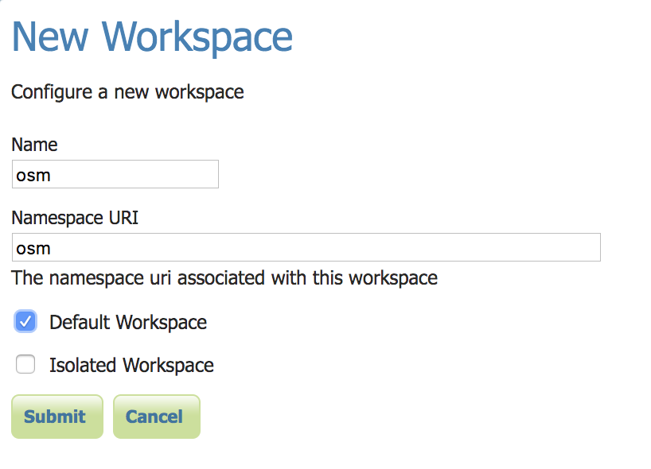
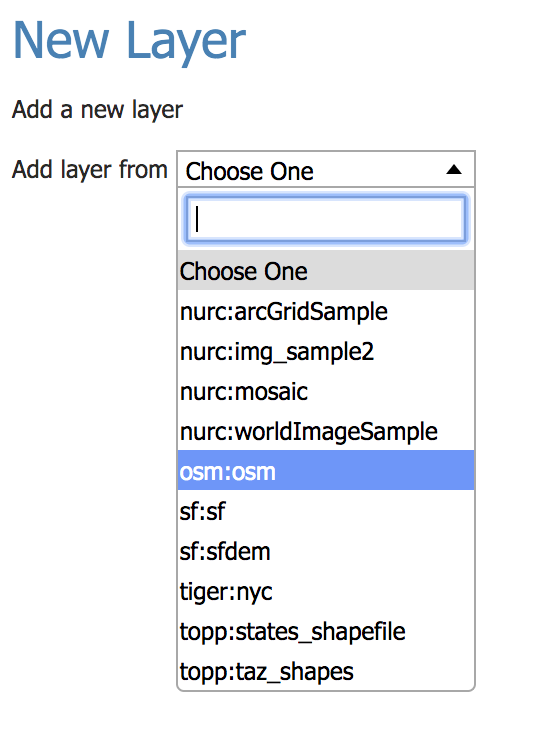
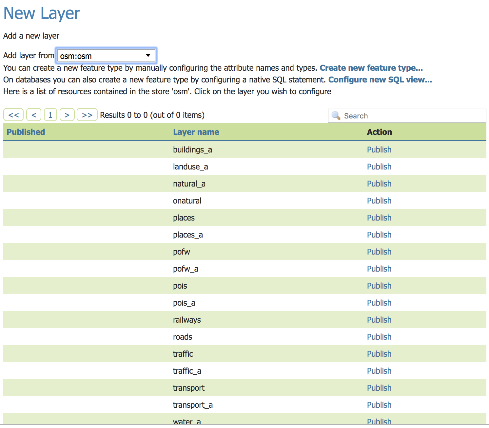
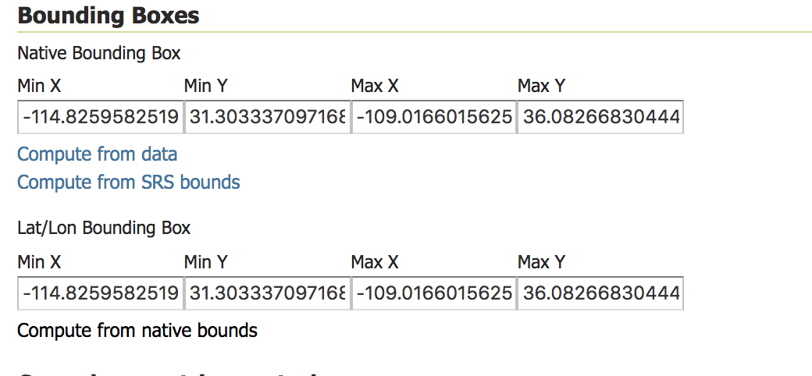

# Assignment: PostGIS III - OSM PostGIS to Geoserver
## Worth: 40 points
## Due: Saturday, April 27, 11:59pm

## Background
Geoserver most commonly serves data from databases. Having databases back a geoserver layer allows the layer to be dynamic, meaning that geoserver will always serve the most recent data. Updating static files such as shapefiles is quite
cumbersome and error-prone, not to mention slow. In this lab you are going to create geoserver layers from the PostGIS tables you created. As part of this process, you will also create Style Layer Descriptors, or SLDs, from QGIS, to allow geoserver to
customize the symbolization of your data.

## Prerequisites
Geoserver and Postgresql must be running. In a production environment these would be external services running on
managed (possibly dedicated) servers. In this class, you are running them on your workstation. If you installed the
EnterpriseDB version of postgresql, then it is likely already running. Geoserver may be running, or may be configured 
to run through the Start Menu.

## Assignment
Deliverables:

### Load the layer in Geoserver
Start geoserver and visit http://localhost:8080/geoserver in your browser. 

#### Create a workspace named `osm`
Geoserver uses workspaces to organize data. Generally speaking, you would create a workspace for a project or a specific
type of data. In this exercize, create a new workspace for all your OSM data. To simplify this assignment, set this new workspace as the default and use the namespace `osm`

Refer to the geoserver documentation about how to add a Workspace. 
- [https://docs.geoserver.org/stable/en/user/data/webadmin/workspaces.html](https://docs.geoserver.org/stable/en/user/data/webadmin/workspaces.html)

#### Create a data store named `osm`
Before you can add the data from the database we need to tell geoserver about the data location. Geoserver uses the term
`data store` to refer to how it data is made available to geoserver. Specifically in this exercize you will create a PostGIS
Data Store, giving geoserver the hostname (`localhost`), as well as database name (`arizona`), and username and password (possibly both `postgres` if you accepted the defaults during installation). 

Refer to the geoserver documentation about how to add a PostGIS Data Store. 
- [https://docs.geoserver.org/stable/en/user/data/database/postgis.html](https://docs.geoserver.org/stable/en/user/data/database/postgis.html)

#### Add PostGIS layers to geoserver
You worked with layers previously in geoserver but now are going to add them yourself. Read up on geoserver layers at
[https://docs.geoserver.org/stable/en/user/data/webadmin/layers.html](https://docs.geoserver.org/stable/en/user/data/webadmin/layers.html). 

Be sure to select the appropriate data source for the layer source next to `Add layer from [Choose One]`:

The next screen will list your data tables. By default they will not be published as layers until you click on `Publish`.

Clicking `Publish` on one of the layers brings up a multi-tabbed window.

To get started, scroll down to the section for `Bounding Box` and click `Compute from data` and `Calculate from native bounds` to populate the bounding box data.

Finally, this software has some legacy aspects to it. One is that _settings are not saved until you click on the `Save` button`._ Be sure to click SAVE!

### Open PostGIS Tables as Layers in QGIS and Style
Open your PostGIS layers in QGIS (`Layer` -> `Add PostGIS Layers` ). QGIS will generate random simple symbologies.
Right click on your `buildings` layer. Change the symbology to `Categorized` and select `type` as the classification Column.
Click `Classify` to load all the unique values for this column. Update the symbology if you desire. When you are satisfied,
Click on the `Style` drop-down at the bottom of the dialog and select `Save style`. 

Save as `SLD Style File`. 

### Style the layer in PostGIS. 

Open GGIS and select the option. 

Open the OSM Arizona layers. Use your expert cartographic skills to customize the styles and create SLDs for each layer. Import the SLDs into geoserver. Create a workspace for the Arizona OSM named “`osm`”. Create layers in the `osm` workspace for each of the OSM tables using a PostGIS DataStore. Apply the appropriate SLDs to each layer. Finally, create a LayerGroup containing the layers. 

The deliverables for the assignment will be:

1. Screenshot showing output of the shp2pgsql output or a full list of the commands used
2. Screenshot showing output of the psql output or a full list of the commands used
3. Screenshot of the PostGIS tables viewed as layers in GQIS
4. Screenshot of geoserver UI showing the list of osm layers
5. Screenshot of a WMS request against the LayerGroup
