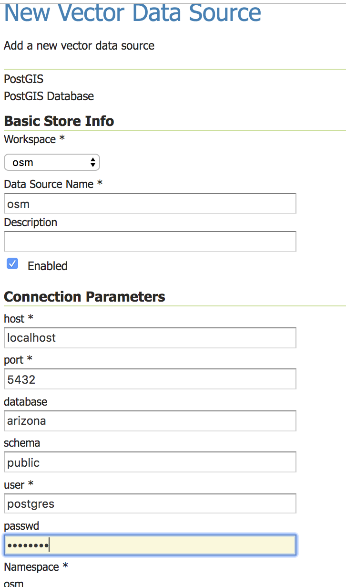
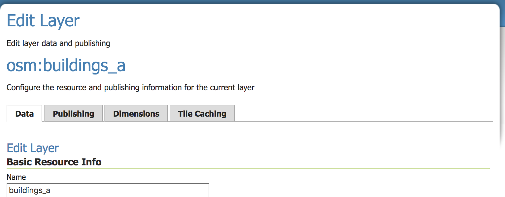
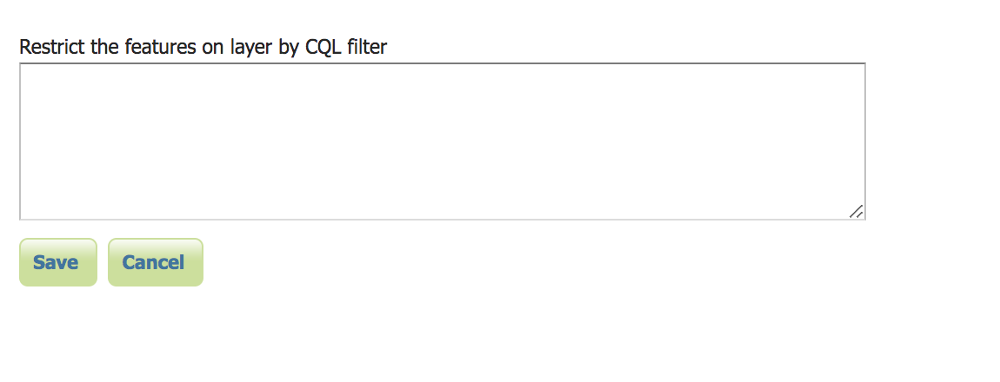
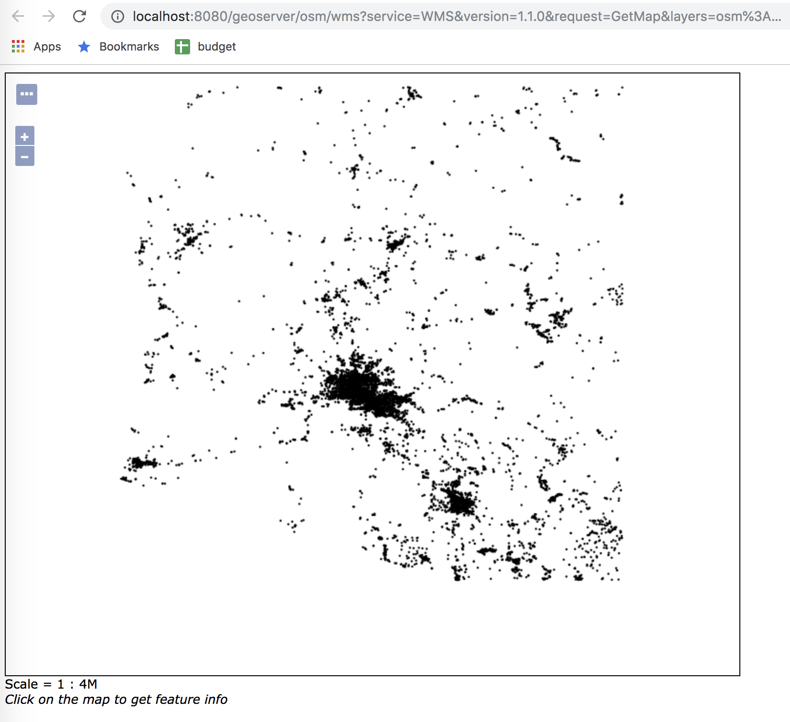
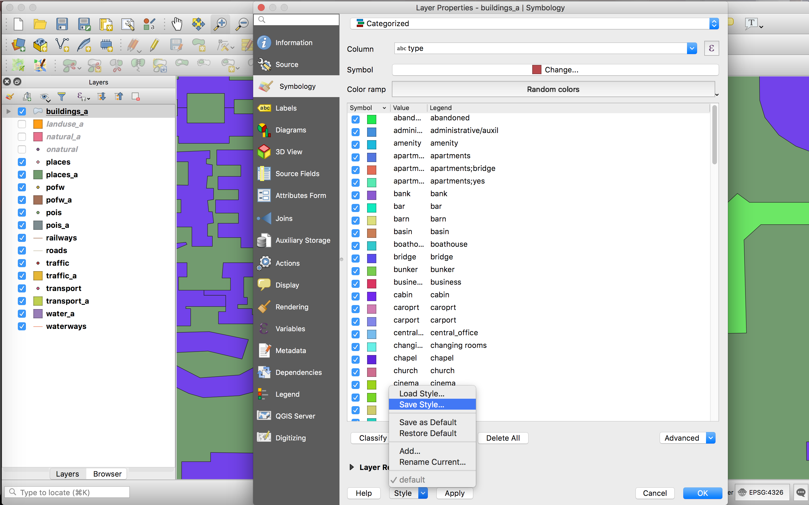
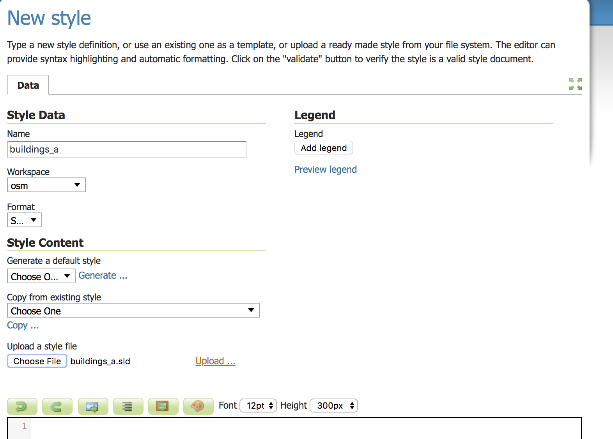
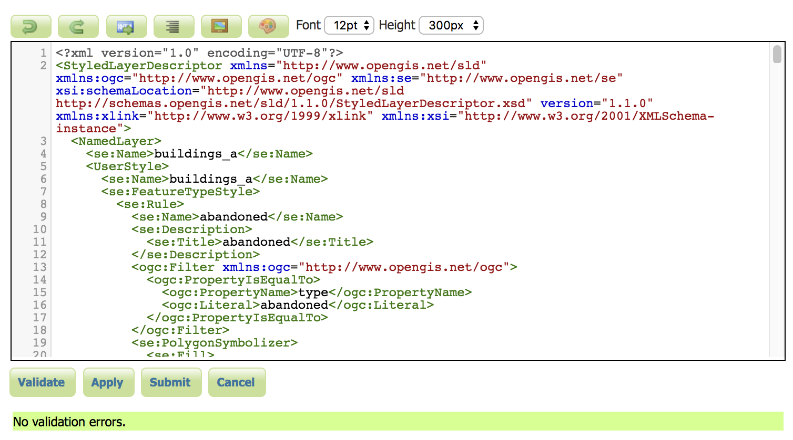
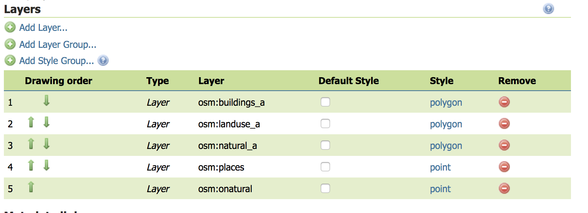
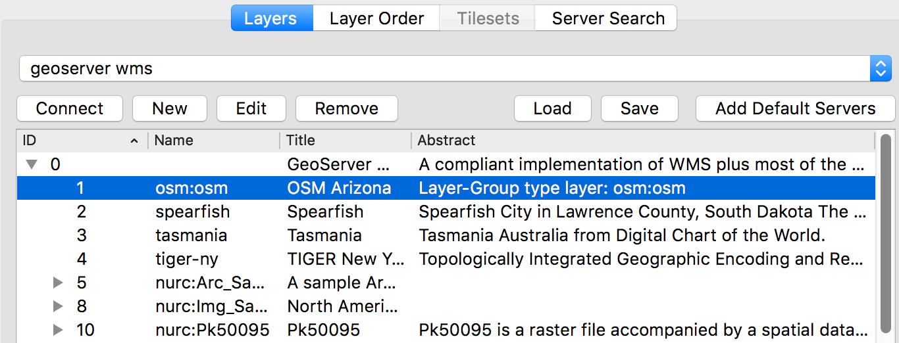

# Assignment: PostGIS to Geoserver

## Background
Geoserver most commonly serves data from databases. Having databases back a geoserver layer allows the layer to be dynamic, meaning that geoserver will always serve the most recent data. Updating static files such as shapefiles is quite
cumbersome and error-prone, not to mention slow. In this lab you are going to create geoserver layers from the PostGIS tables you created. As part of this process, you will also create Style Layer Descriptors, or SLDs, from QGIS, to allow geoserver to customize the symbolization of your data.

## Prerequisites
Geoserver and Postgresql must be running. In a production environment these would be external services running on
managed (possibly dedicated) servers. In this class, you are running them on your workstation through docker.
```
docker network create gist604b
docker run --network gist604b --name postgis -v $YOUR_DATA_DIR/postgresql_datadata:/var/lib/postgresql/data -p 25432:5432 mdillon/postgis
docker run --network gist604b --name geoserver -v $YOUR_DATA_DIR/geoserver_data:/opt/geoserver/data_dir -p 8180:8080 kartoza/geoserver
```
where `YOUR_POSTGIS_DATA_DIR` will be a directory on your machine dedicated to housing this database such as `G:/Users/Aaryn/GIST604B/PostgresData` or `/Users/aaryno/postgres_data`. Be sure to unix-style path formatting (e.g., `/` instead of `\` to denote directory separators).

Some errors you might get:
### network with name gist604b already exists
```
Error response from daemon: network with name gist604b already exists
```
which means you already created it. No problem!
###  Conflict. The container name "/postgis" (or "/geoserver") is already in use by container 
```
docker: Error response from daemon: Conflict. The container name "/postgis" is already in use by container "ec13495fa94b54f4bb6a05d65dd8e5b6af08a93644978347942f4218e8659b56". You have to remove (or rename) that container to be able to reuse that name.
```
That means a container with that name is already running. Without knowing the exact configuration of that container, we should be able to safely shut it down with:
```
docker stop postgis
docker rm postgis
```
Which will stop the container and remove it, allowing you to create a new container with the same name and with the settings we need for this assignment.

## Assignment
### Deliverables: 
Create a github branch named `osm` with the following files, submitting as a Pull Request to `master`:
- `landuse.sld`
- `roads.sld`
- `pois.sld`
- `geoserver_layer_group_preview.png` - OpenLayers preview of `osm` Layer Group, zoomed into Tucson 
- `qgis_layer_group_preview.png` - QGIS view of `osm` Layer Group

### Load the layers in Geoserver
Visit http://localhost:8180/geoserver in your browser. 

#### Create a workspace named `osm`
Geoserver uses workspaces to organize data. Generally speaking, you would create a workspace for a project or a specific
type of data. In this exercize, create a new workspace for all your OSM data. To simplify this assignment, set this new workspace as the default and use the namespace `osm`

Refer to the geoserver documentation about how to add a Workspace. 
- [https://docs.geoserver.org/stable/en/user/data/webadmin/workspaces.html](https://docs.geoserver.org/stable/en/user/data/webadmin/workspaces.html)


#### Create a data store named `osm`
Before you can add the data from the database we need to tell geoserver about the data location. Geoserver uses the term
`data store` to refer to how it data is made available to geoserver. Specifically in this exercize you will create a PostGIS
Data Store, giving geoserver the hostname , as well as database name, and username and password (`postgres` and `postgres`). 

In the docker compose implementation, the hostname of the DB server is the name of the service, `postgis`.
The database name will be either `hawaii` or `arizona`, depending on which version of the assignment you completed.

Refer to the geoserver documentation about how to add a PostGIS Data Store. 
- [https://docs.geoserver.org/stable/en/user/data/database/postgis.html](https://docs.geoserver.org/stable/en/user/data/database/postgis.html)



#### Add PostGIS layers to geoserver
You worked with layers previously in geoserver but now are going to add them yourself. Read up on geoserver layers at
[https://docs.geoserver.org/stable/en/user/data/webadmin/layers.html](https://docs.geoserver.org/stable/en/user/data/webadmin/layers.html). 

Be sure to select the appropriate data source for the layer source next to `Add layer from [Choose One]`:


The next screen will list your data tables. By default they will not be published as layers until you click on `Publish`.


Clicking `Publish` on one of the layers brings up a multi-tabbed window.


To get started, scroll down to the section for `Bounding Box` and click `Compute from data` and `Calculate from native bounds` to populate the bounding box data.


Finally, this software has some legacy aspects to it. One is that _settings are not saved until you click on the `Save` button._ Be sure to click SAVE!



##### Layer Preview
To see a preview of your layer, click on `Layer Preview` in the left hand main menu, and then click `Open Layers` in the
row for a given layer. This will bring up a minimal interactive map to look at your data. For example, this is what your `buildings_a` preview might look like (Note that screenshot has the geoserver instance running on `8080` but we are using `8180` for our purposes:



#### Repeat this process for all your OSM layers.

### Create Styles for layers in QGIS
Open your PostGIS layers in QGIS (`Layer` -> `Add PostGIS Layers` ). QGIS will generate random simple symbologies.
Right click on your `buildings` layer. Change the symbology to `Categorized` and select `type` as the classification Column.
Click `Classify` to load all the unique values for this column. Update the symbology if you desire. When you are satisfied,
Click on the `Style` drop-down at the bottom of the dialog and select `Save style`. 



Save as `SLD Style File`. Give it the same name as the table name but with the `.sld` file suffix.
Repeat for the tables: `pois`, `roads`, and `landuse`.

#### Deliverables: SLD files for `landuse`, `roads`, and `pois`.

### Create Styles for layers in Geoserver
Read up on styles at [https://docs.geoserver.org/stable/en/user/styling/index.html#styling](https://docs.geoserver.org/stable/en/user/styling/index.html#styling).

In Geoserver, click on `Styles` at the left main menu and then `Add a New Style`. Fill in the name of the style (`buildings_a` for example, matching the table name) and specify the `osm
` workspace. Click on the `Choose File` button
and select the SLD file for the style you are creating, then click `Upload`. 



This will load the file and fill the dialog below with the text from the SLD file. Scroll down and inspect the loaded style:



Don't edit the SLD here, but just in case, click on `Validate` to make sure there are no validation errors, then `Apply` or `Save`.

Repeat for all the styles you made SLDs for above.

### Create a Layer Group
Layers can be grouped together for complex cartography. Read up on layer groups: [https://docs.geoserver.org/stable/en/user/data/webadmin/layergroups.html](https://docs.geoserver.org/stable/en/user/data/webadmin/layergroups.html).

Create a Layer group named `osm` with the title `OSM` in the `osm` workspace. 

Add all the PostGIS layers to the layer group. Arrange them in order so that points and lines are over polygons. 
The order listed is actually the `Drawing Order`, which will be in reverse order of what will appear on top; that is, 
layers at the top of the list will be drawn first and layers at the bottom will be drawn last. Thus, you will want
lines and points _below_ the polygon layers.



Be sure to `Generate Bounds` and then `Save` the Layer Group like you did for the Layers.

#### Deliverable: Geoserver Screenshot
Visit the Layer Groups list in geoserver and look at the Open Layers preview. Zoom into Tucson and take a screen capture 
of your browser. Name it `geoserver_layer_group_preview.png`

### Load the Geoserver Layer Group from QGIS

In QGIS, click `Layer` -> `Add Layer` -> `WMS/WMTS`. You should have your local geoserver connection saved from
previously but, if not, add a new connection to localhost by adding the url to the WMS GetCapabilities request. 
While remembering the URL could be handy, it will be easiest for you to visit the `Demos` link on the left-hand main menu
of geoserver webpage and find the `WMS_getCapabilities.url`. 

Once you are connected to geoserver localhost from within QGIS in the `WMS/WMTS` dialog, you should see your newly created `osm` Layer Group. 



#### Deliverable: QGIS Screenshot
Take a screenshot of your QGIS desktop (including the layer list and the map) showing the OSM Workshop Layer Group. Name it `qgis_layer_group_preview.png`

[](https://zenodo.org/badge/latestdoi/182493806)

